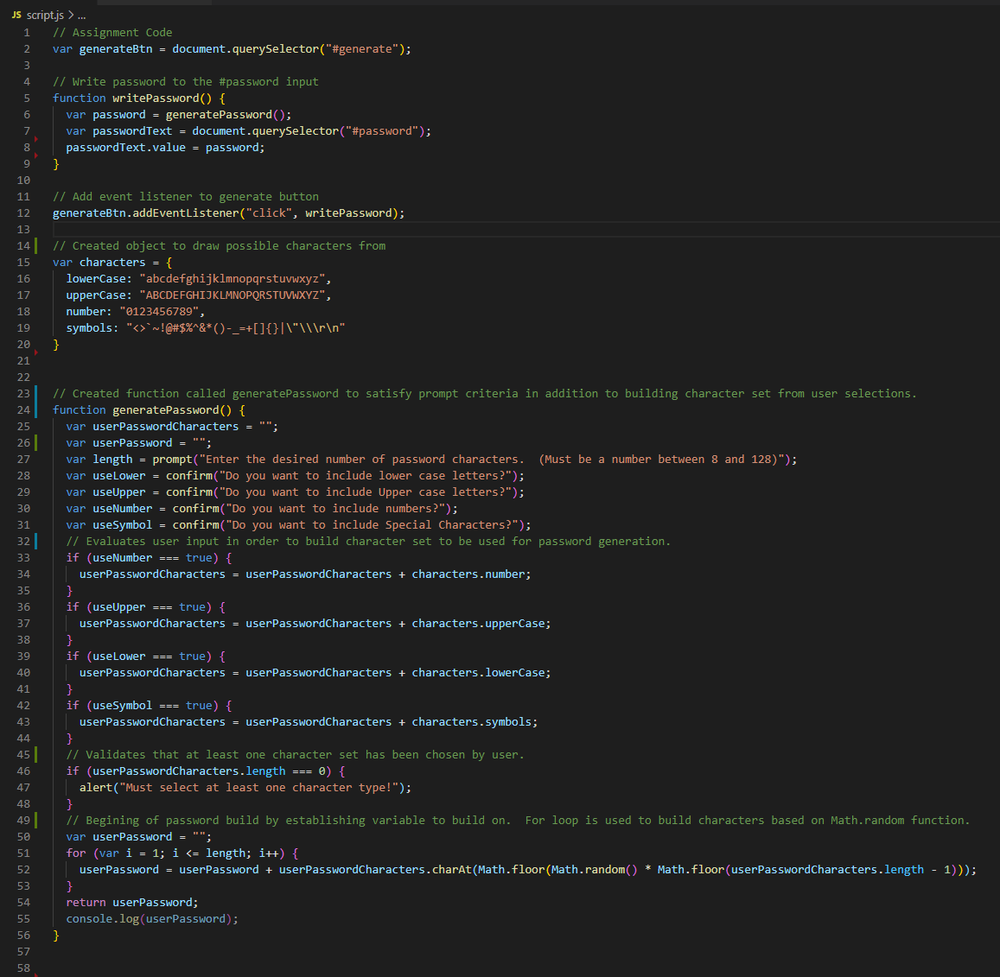

# Random-Password-Generator
Deployed Application: [Random Password Generator](https://jeashwor.github.io/Random-Password-Generator/)

## Criteria
- Prompt Length of password between 8 - 128.
- Confirm use of lower case, upper case, numbers, and special characters. 
- Validate that at least one set of above characters has been chosen. 
- Generate Password and display in corresponding area of provided HTML document.

## Functionality created
- Added Event Listener to button element. 
- Created object to contain character sets to be used. 
- Created function to accomplish the following
    - Take user inputs.
    - Build character set from user inputs
    - Produce random password using Math.random within a for loop to build the password from defined character set.
    - Return password value to be passed into HTML document.  

## JavaScript Screen Shot

## HTML Page with password result for 50 characters using lower case, upper case, numbers, and special characters. 

